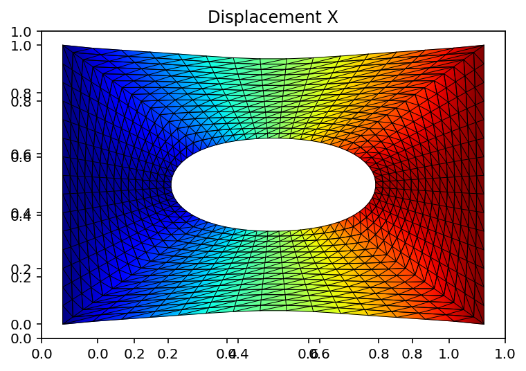

This piece of the code taken from Ali Javili youtube page which is  walking you through step-by-step to create your FEM code:

Here is the breakdown of the code:

There first part of the code (Uniform mesh, void mesh) create the mesh for rectangular 2D body. 
Second part of the code which is basically creating the element stiffness and assembling the stiffness matrix and the computing the stress/strain at each node/gauss points
The third part which is the post porcess and create the plot

